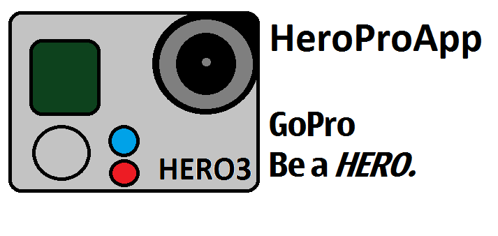

HeroProApp
==========

HeroPro App, the Free OpenSource HTML5 / Native app to control, liveview and view content of GoPro HERO cameras.

You can choose either the HTML5 app or the native one 

HeroPro is based on [GoPro WIFI hack repo](https://github.com/KonradIT/goprowifihack)

###[Screenshots](https://gist.github.com/KonradIT/9851730)
Cameras
--------

The app currently supports GoPro HERO2, GoPro HERO3 Black, GoPro HERO3 Silver, GoPro HERO3+ Black

HTML5
------

An index.html is updated with the latest code.

Native
-------

* Android App: OPEN THIS LINK IN AN ANDROID DEVICE: http://chernowii.com/hpa
* Chrome App: In WIP, the chrome packaged app does not allow XHR to work, i have followed everything in the internet, still no luck. https://github.com/KonradIT/HeroProApp/tree/gh-pages/Chrome
* Windows Phone 8 App: OPEN THIS LINK IN A WP8 DEVICE: http://chernowii.com/hpawp8
* Windows Phone 8.1 App: OPEN THIS LINK IN A WP8.1 DEVICE: http://chernowii.com/hpawp8-1
* Windows 8 App: OPEN THIS LINK IN A W8.1 TABLET: http://chernowii.com/hpaw8-1
* Windows 7 App: OPEN THIS LINK IN A Windows 7 PC: http://chernowii.com/hpaw7

Server
------

Download the index file you want, copy it to the root of the SD (where DCIM and MISC are), name it heropro.html

Then go to 10.5.5.9:8080/videos/heropro.html

WebApp
------
The WebApp is the index.html file uploaded to a webpage.

HOW TO USE THE WEBAPP

* Connect to the internet
* Go to the URL that is assigned to your device (see below)
* Then connect to the GoPro wifi
* Go back to the web browser
* DONT REFRESH THE WEB BROWSER!
* DONT FORGET TO WRITE YOUR GOPRO WIFI PASS IN THE APP

URLs
----

Computer (MacOSX, Windows and Linux): http://pc.heropro.chernowii.com

Mobile (iOS, Android, WP8, Firefox OS, Blackberry OS): http://m.heropro.chernowii.com

#OS

According to the graph, android is the most used OS. Android accept to download a APK from the internet and install the app, without any google play fee.

Windows Phone allows to install apps without the market.

Contribute
-----------

Please contribute of you know HTML5 or a Native language, or if you know more commands (see commands.md) or testing the app with your camera (bugs must be reported to [my mail](mailto:mail@chernowii.com))

Donate
------

Donate [Eur](https://www.paypal.com/us/cgi-bin/webscr?cmd=_flow&SESSION=xzvRRl1F77J6j1KZ6rDfWOFg1FGXikvhFAOZsvyuYEvRwrcKHF2OSnrh-iK&dispatch=5885d80a13c0db1f8e263663d3faee8def8934b92a630e40b7fef61ab7e9fe63) or [Usd](https://www.paypal.com/us/cgi-bin/webscr?cmd=_flow&SESSION=Tshee-GpFUZlApx4t09KN5o12D5XQbapLvF_2fCoPacE1SOZ81J5RxGXI9K&dispatch=5885d80a13c0db1f8e263663d3faee8def8934b92a630e40b7fef61ab7e9fe63)

you can also donate in my website http://chernowii.com in the gopro hack section or app section.

Status
------

Follow #heropro on [twitter](https://twitter.com/search?q=%23heropro&src=typd&f=realtime)

Thanks
-------

Special thanks to [r1pper](http://github.com/r1pper) and [sprhawk](http://github.com/sprhawk)
